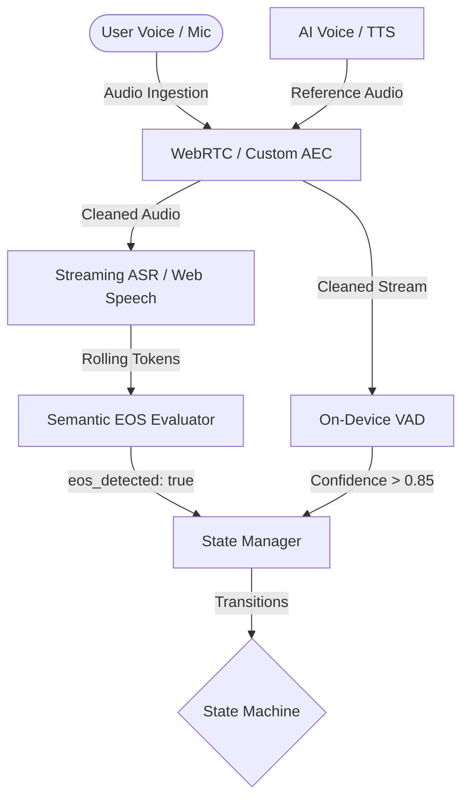

# Voice AI Linguistic EOS Platform

A real-time, bi-directional Voice AI application featuring non-silence-based End-of-Speech (EOS) detection and real-time interruption handling (<300ms latency). 

Built using a **Python (FastAPI)** backend and a **React (Vite)** frontend.

---

## System Architecture



### Components
1. **Audio Ingestion Layer**: Captures microphone input and integrates WebRTC Acoustic Echo Cancellation (AEC) combined with a custom spectral subtraction solver to strip the AI's playback voice from the microphone.
2. **Real-time VAD**: Custom Voice Activity Detector in Javascript analyzing Root Mean Square (RMS) energy, Zero Crossing Rate (ZCR), and Spectral Centroid in <50ms.
3. **Streaming ASR**: Integrates browser Web Speech API for zero-latency local speech recognition.
4. **Semantic EOS Evaluator**: FastAPI server endpoint that parses the rolling transcript and queries an LLM (Gemini 2.0 Flash or Llama 3 8B via OpenRouter) to determine intent/grammatical completeness, with a local heuristic fallback.
5. **State Manager**: Orchestrates 4 states: `LISTENING`, `THINKING`, `SPEAKING`, and `INTERRUPTED`.

---

## Installation & Running

Ensure you have **Python 3.11+** and **Node.js 18+** installed.

### 1. Environment Variables Configuration

Create a `.env` file inside the `backend/` directory and configure the following variables:

```env
# OpenRouter API Key (Required for LLM-based Semantic EOS and response generation)
OPENAI_API_KEY=your_openrouter_api_key_here

# OpenRouter API Base URL (Optional, defaults to https://openrouter.ai/api/v1)
OPENAI_BASE_URL=https://openrouter.ai/api/v1

# OpenRouter Model Identifier (Optional, defaults to google/gemini-2.0-flash which maps internally to google/gemini-2.5-flash)
OPENAI_MODEL=google/gemini-2.0-flash

# Google GenAI API Key (Optional, required for native Gemini SDK audio upload/transcription)
# Can use either GEMINI_API_KEY or GOOGLE_API_KEY
GEMINI_API_KEY=your_google_gemini_api_key_here
GOOGLE_API_KEY=your_google_gemini_api_key_here
```

### 2. Backend (FastAPI)
Open a new terminal window:
```bash
cd backend
source venv/bin/activate
python main.py
```
*The FastAPI server will run on `http://127.0.0.1:8000`.*

### 3. Frontend (React)
Open a second terminal window:
```bash
cd frontend
npm run dev
```
*The React application will run on `http://127.0.0.1:5173`.*

---

## State Machine & Transitions

1. **LISTENING**:
   - Captures microphone input and streams transcription logs.
   - Evaluates the rolling words against the Semantic EOS Evaluator.
   - Transitions to **THINKING** when `eos_detected: true` is returned.
   
2. **THINKING**:
   - Queries the backend for response generation.
   - Transitions to **SPEAKING** once response returns.

3. **SPEAKING**:
   - Plays back the response using Text-to-Speech (TTS).
   - Generates an active reference signal in the audio graph.
   - If VAD detects speech onset (Confidence > 0.85) on the processed microphone line, transitions immediately (<300ms) to **INTERRUPTED**.

4. **INTERRUPTED**:
   - Halts the TTS playback buffer instantly.
   - Truncates the AI response up to the character offset at interruption.
   - Resets buffers and transitions back to **LISTENING** to capture the new utterance.

---

## Verification Scenarios

### 1. Testing Linguistic EOS (Natural Pauses)
- Say: *"I want to... [pause] examine polymorphism."*
- Notice that the evaluator returns `eos_detected: false` during the pause (due to trailing filler words or incomplete clauses), preventing premature interruption.
- Say: *"Show me the code."* 
- The sentence will immediately evaluate as complete and transition states.

### 2. Testing Speech Interruption
- Trigger a long response (e.g. say *"what is polymorphism"*).
- While the agent is speaking, speak into your microphone.
- The visualizer will show the TTS reference being subtracted, the VAD confidence spiking, and the playback halting instantly.
